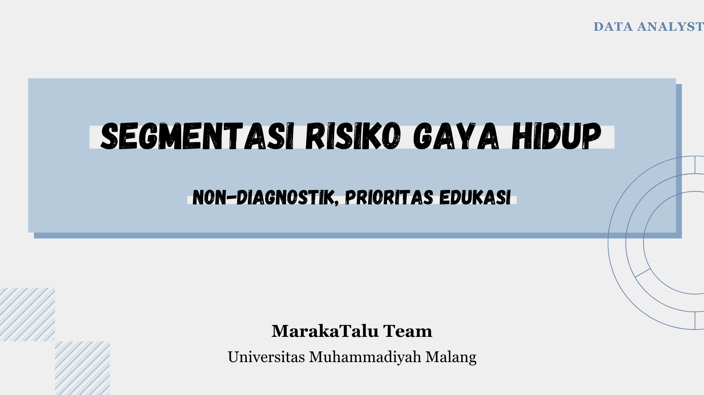
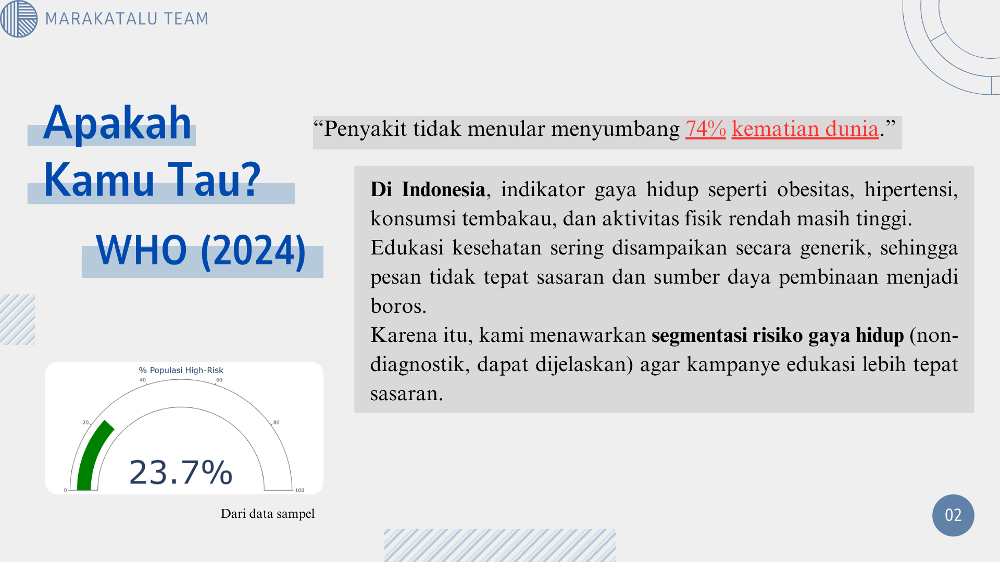
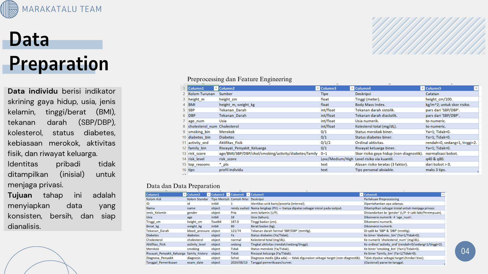
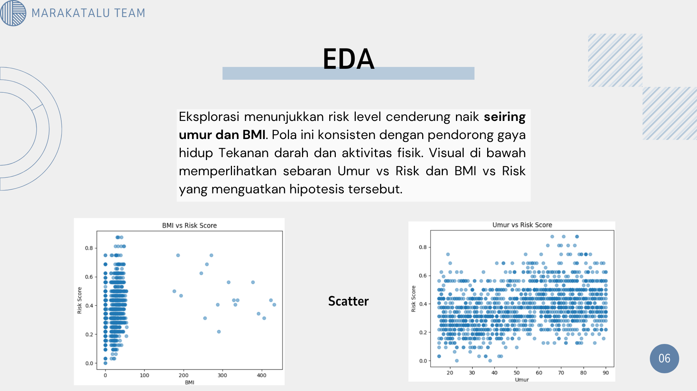
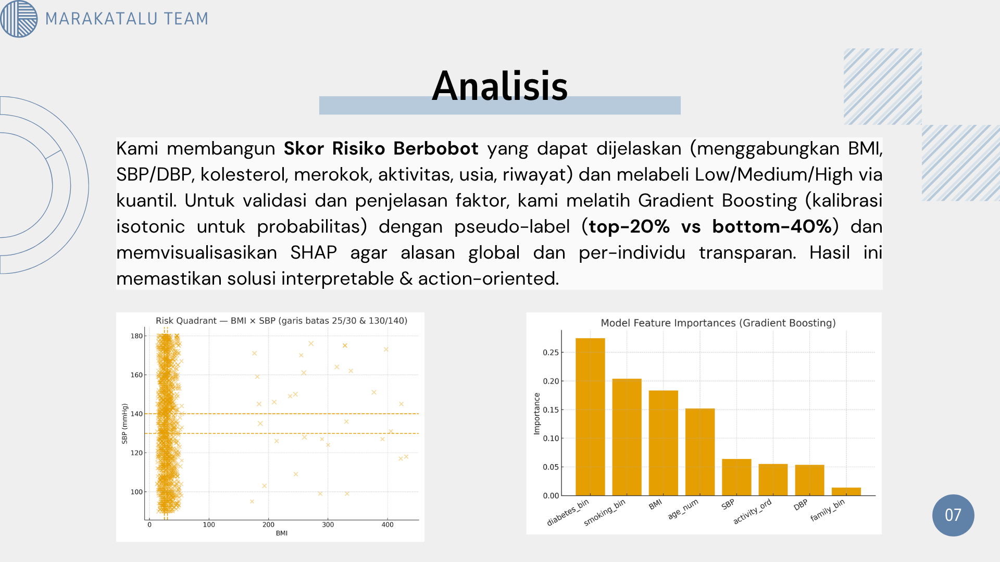
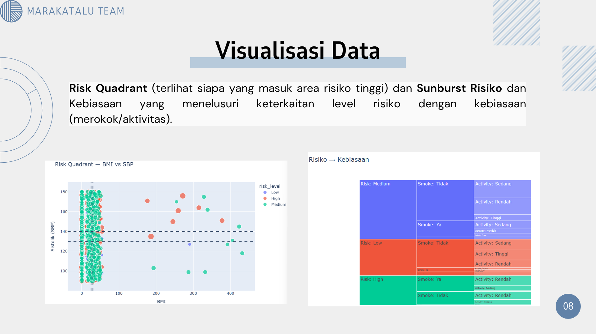
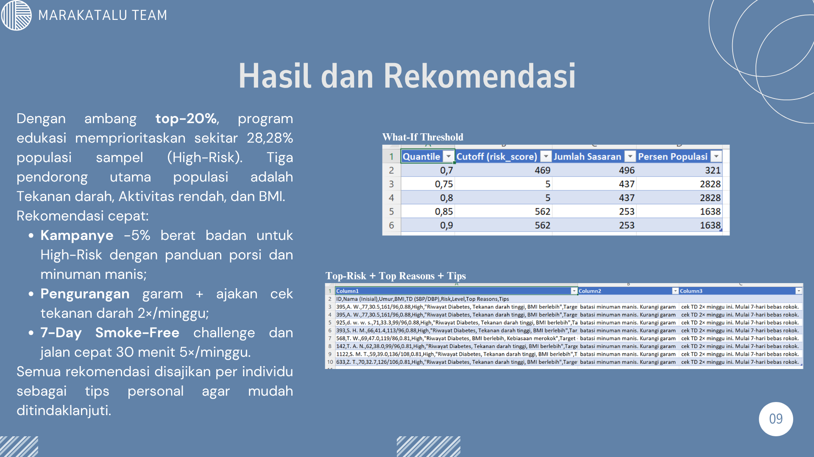
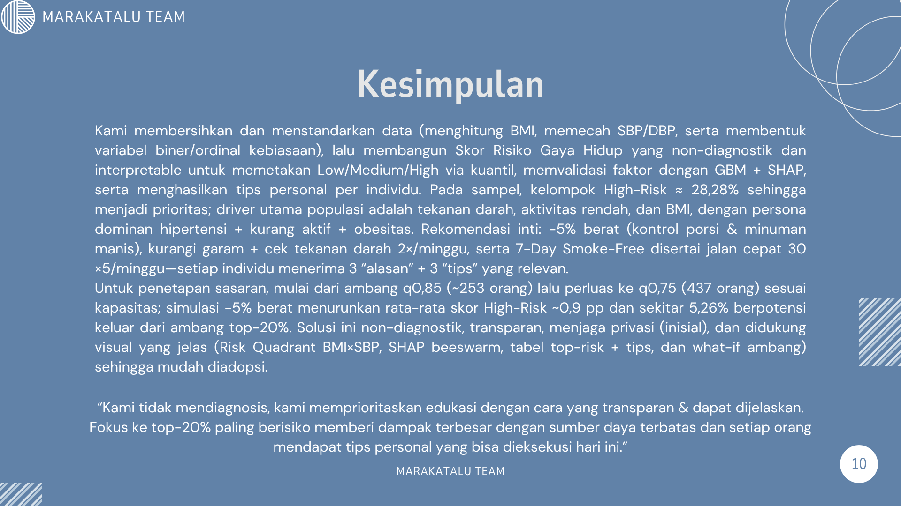

# 🧠 Lifestyle Risk Segmentation for Public Health Campaign

🏆 **Finalist – Data Analyst Competition, DevFest Surabaya 2025**

### 🟡 Competition Project (Data Challenge / Hackathon)  
DevFest Surabaya 2025

---

## 🚀 Project Overview

This project develops an **explainable risk segmentation framework** for lifestyle-related health conditions, aimed at improving **targeting accuracy of public health campaigns**.

The system does **not perform medical diagnosis**, but instead:
- Quantifies individual risk scores  
- Segments population into risk tiers  
- Provides interpretable and actionable recommendations  

---

## 🧠 Problem Context

Non-communicable diseases account for a dominant share of global mortality.  
In many contexts, public health messaging remains **generic and inefficient**, lacking segmentation grounded in empirical data.

This project addresses that gap through **data-driven risk stratification**.

---

## 📊 Data Understanding

Dataset characteristics:
- Sample size: 1,545 individuals  
- Variables include:
  - Body Mass Index (BMI)  
  - Blood Pressure (SBP/DBP)  
  - Smoking habits  
  - Physical activity  
  - Diabetes history  

These variables represent **key behavioral and physiological risk indicators**.

---

## ⚙️ Data Preparation

Preprocessing pipeline:
- Feature cleaning and normalization  
- BMI computation  
- Blood pressure parsing (SBP/DBP split)  
- Binary and ordinal encoding  
- Construction of composite risk score  

The objective is to produce a **consistent, analysis-ready dataset**.

---

## 🔍 Exploratory Data Analysis

Key observations:
- Risk levels increase with **age and BMI**  
- Strong associations identified between:
  - Hypertension  
  - Physical inactivity  

EDA validates the hypothesis that **lifestyle variables are dominant predictors**.

---

## 🧠 Modeling & Analysis

Approach:
- Weighted risk scoring model  
- Quantile-based segmentation:
  - Low Risk  
  - Medium Risk  
  - High Risk  

To ensure interpretability:
- Feature contribution is analyzed  
- Model outputs remain transparent and explainable  

---

## 📈 Visualization & Insight

Findings:
- High-risk clusters concentrate in:
  - High BMI  
  - Elevated blood pressure  
- Behavioral patterns (smoking, inactivity) significantly influence segmentation  

This enables **targeted intervention design**.

---

## 🎯 Results & Recommendation

Key results:
- ~28% of population classified as **High Risk**  
- Dominant drivers:
  - Blood pressure  
  - Physical inactivity  
  - BMI  

Recommended actions:
- Targeted health campaigns  
- Preventive lifestyle programs  
- Personalized intervention strategies  

---

## 📌 Conclusion

- Risk segmentation enhances **precision in public health targeting**  
- Explainable modeling supports **transparent decision-making**  
- Framework is scalable for broader population-level deployment  

---

## 👥 Team & Contributions

| Name | Role | Contribution |
|------|------|-------------|
| **Muhammad Wildan Nabila** | Lead Data Scientist | Project design, modeling, analysis, insight generation |
| **Ilman Nafian** | Full Stack Developer | Web application development & deployment |
| **Irawana Juwita** | Data Analyst | Data preprocessing, EDA, validation |

---

## 🔗 Presentation

📊 Canva Slides:  
https://canva.link/2twsf1ms0kozj70

---

## 💡 Key Contributions

- Interpretable risk scoring system  
- Data-driven segmentation strategy  
- Actionable insights for public health policy  

---
