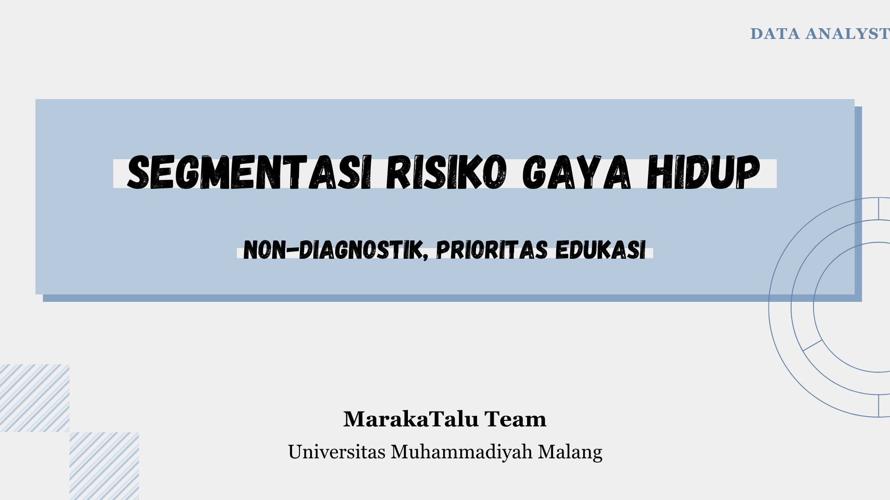
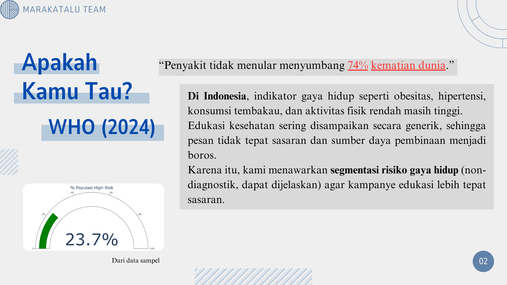
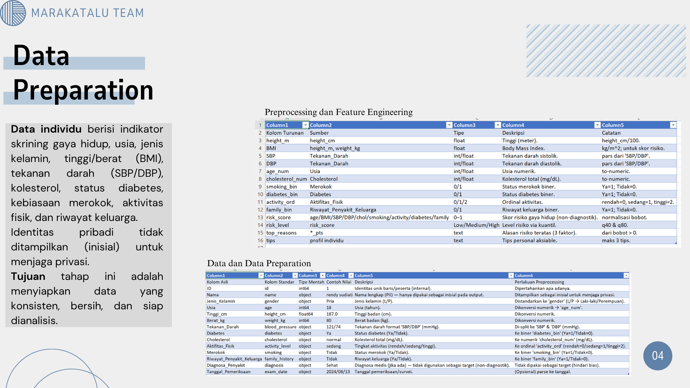
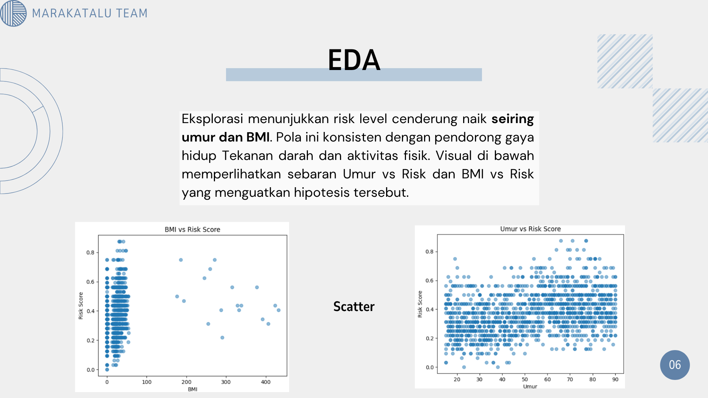
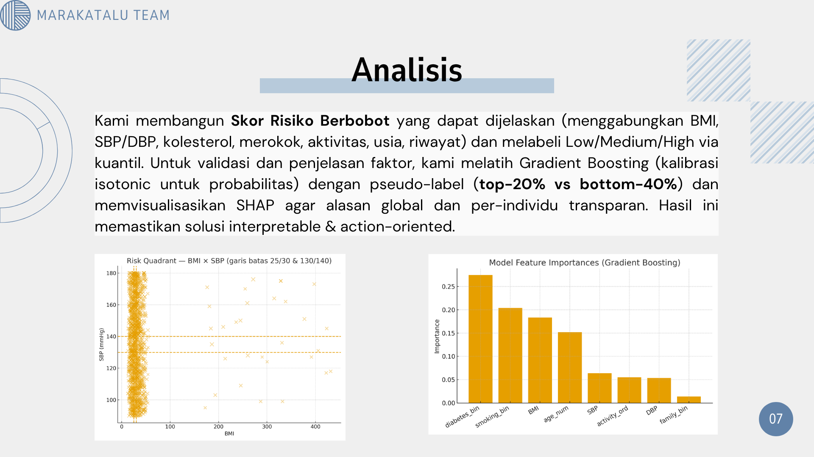
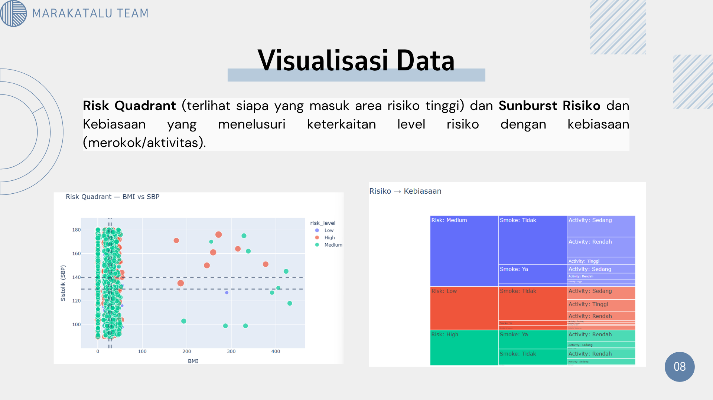
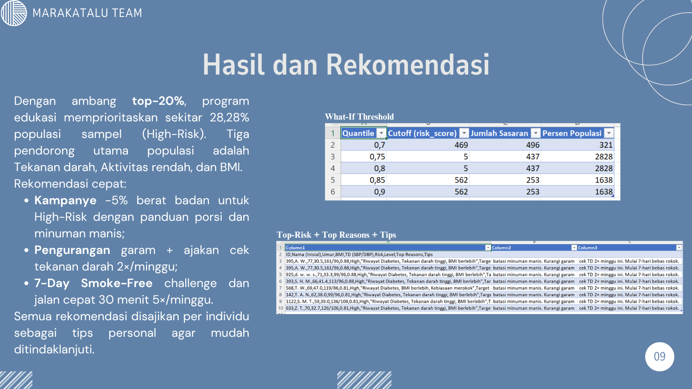
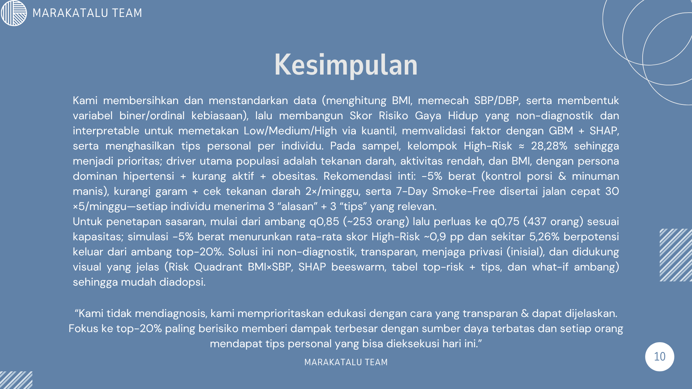

<div align="center">

# Lifestyle Risk Segmentation for Public Health Campaigns

### Explainable Risk Analytics · Population Segmentation · Public Health Intelligence

**Finalist - Data Analyst Competition, DevFest Surabaya 2025**

<br>


<br>


<br><br>

**1,545 Individuals · 3 Risk Segments · Explainable Scoring · Campaign Intelligence**

<br>

[](https://canva.link/7m8dcxcqrklozjo)

</div>

---

## Project at a Glance

<table>
<tr>
<td align="center" width="20%">
<strong>1,545</strong><br>
Individuals
</td>
<td align="center" width="20%">
<strong>3</strong><br>
Risk Segments
</td>
<td align="center" width="20%">
<strong>≈28%</strong><br>
High Risk
</td>
<td align="center" width="20%">
<strong>Explainable</strong><br>
Risk Scoring
</td>
<td align="center" width="20%">
<strong>Finalist</strong><br>
DevFest 2025
</td>
</tr>
</table>

> **Project focus:** Transforming lifestyle and physiological indicators into interpretable population-risk segments for more targeted public health campaign planning.

---

# Problem Context

Public health campaigns often address populations with substantially different lifestyle and physiological risk profiles.

A uniform intervention strategy may overlook these differences.

The analytical challenge is therefore not simply to identify whether risk factors exist, but to determine:

> ### How can multiple lifestyle and physiological indicators be transformed into transparent population segments that support targeted preventive campaigns?

This project develops an **explainable risk-segmentation framework** that converts selected indicators into an interpretable composite score and groups individuals into:

<div align="center">


</div>

The framework is intended for **analytical segmentation and campaign prioritization**, not medical diagnosis or individual clinical decision-making.

---

## Project Visualization

<p align="center">
  
</p>

The analysis connects lifestyle and physiological indicators with an interpretable segmentation framework designed to support population-level prevention strategies.

---

# Analytical Objectives

The project was designed to:

- Quantify selected lifestyle-related risk indicators.
- Construct an interpretable composite risk score.
- Segment individuals into Low, Medium, and High Risk groups.
- Identify variables associated with elevated risk profiles.
- Analyze demographic and behavioral patterns across segments.
- Translate analytical findings into campaign-oriented recommendations.
- Preserve interpretability throughout the analytical workflow.

---

# Dataset & Analytical Scope

| Dimension | Scope |
|---|---|
| **Sample size** | **1,545 individuals** |
| **Domain** | Public Health Analytics |
| **Primary variables** | BMI, Blood Pressure, Smoking, Physical Activity, Diabetes History |
| **Output** | Low · Medium · High Risk |
| **Scoring strategy** | Weighted Composite Risk Score |
| **Segmentation strategy** | Quantile-Based Segmentation |
| **Analysis** | EDA · Risk Profiling · Segment Comparison |
| **Primary use case** | Public Health Campaign Prioritization |

The framework combines behavioral and physiological information to create a **population-level analytical representation of relative risk**.

---

# Analytical Framework

```text
                    RAW HEALTH & LIFESTYLE DATA
                               │
                               ▼
                       Data Validation
                               │
                               ▼
                     Cleaning & Normalization
                               │
                               ▼
                      Feature Engineering
                               │
                  ┌────────────┴────────────┐
                  ▼                         ▼
             BMI Parsing             Blood Pressure
                  │                         │
                  └────────────┬────────────┘
                               ▼
                  Composite Risk Scoring
                               │
                               ▼
                   Quantile Segmentation
                               │
             ┌─────────────────┼─────────────────┐
             ▼                 ▼                 ▼
          LOW RISK        MEDIUM RISK        HIGH RISK
             │                 │                 │
             └─────────────────┼─────────────────┘
                               ▼
                 Segment-Level Analysis
                               │
                               ▼
                    Insight Extraction
                               │
                               ▼
                  Campaign Recommendations
```

The workflow emphasizes **transparency and traceability**: each analytical stage can be interpreted without relying on a black-box prediction mechanism.

---

# Risk Segmentation Logic

Rather than producing a clinical diagnosis, the framework combines selected indicators into a **composite analytical score**.

Conceptually:

```text
Risk Score
    │
    ├── BMI-related indicator
    ├── Blood-pressure indicator
    ├── Smoking behavior
    ├── Physical activity
    └── Diabetes history
            │
            ▼
     Weighted Aggregation
            │
            ▼
       Relative Risk Score
            │
            ▼
     Quantile Segmentation
```

This design prioritizes two properties:

| Principle | Purpose |
|---|---|
| **Interpretability** | Make the contribution of selected indicators understandable |
| **Segmentation** | Convert continuous scores into operational population groups |

> Risk categories represent **relative analytical segments within the studied dataset** and should not be interpreted as validated clinical classifications.

---

# Evidence at a Glance

<table>
<tr>
<td align="center" width="33%">

### ≈28%

**High-Risk Segment**

Approximately 28% of the analyzed population was assigned to the High Risk group.

</td>
<td align="center" width="33%">

### 3 Segments

**Population Stratification**

Low Risk · Medium Risk · High Risk

</td>
<td align="center" width="33%">

### Multi-Factor

**Risk Profiling**

Lifestyle and physiological indicators were analyzed jointly.

</td>
</tr>
</table>

---

# Key Analytical Findings

## 01 · A Distinct High-Risk Segment Emerged

<div align="center">


</div>

Approximately **28% of the analyzed population** was classified within the High Risk segment under the project's scoring and quantile-segmentation framework.

This group represents a potential priority population for further assessment and targeted preventive communication.

---

## 02 · Multiple Indicators Shaped Elevated Risk Profiles

The analysis highlighted three particularly important dimensions:

<div align="center">


</div>

Within the project's scoring framework, blood-pressure characteristics, BMI, and physical inactivity contributed substantially to elevated risk profiles.

These findings provide interpretable dimensions for segment-level analysis.

---

## 03 · Risk Profiles Varied Across Age and Obesity Indicators

Higher-risk segments showed stronger representation among observations associated with increasing age and obesity-related indicators.

This suggests that population segmentation can reveal patterns that are less visible when all individuals are analyzed as a single homogeneous group.

---

## 04 · Interpretability Was Preserved by Design

The analytical framework intentionally favors a transparent scoring architecture.

Instead of asking only:

> **Who belongs to the highest-risk segment?**

the framework also supports:

> **Which measured indicators contributed to that segmentation?**

This distinction improves analytical traceability and makes the resulting segmentation easier to communicate to non-technical stakeholders.

---

# Analytical Workflow

## Problem Definition

<p align="center">
  
</p>

---

## Data Understanding

<p align="center">
  
</p>

---

## Data Preparation

<p align="center">
  
</p>

---

## Exploratory Data Analysis

<p align="center">
  
</p>

---

## Risk Modeling & Segmentation

<p align="center">
  
</p>

---

## Visualization & Insight

<p align="center">
  
</p>

---

## Results & Recommendations

<p align="center">
  
</p>

---

## Conclusion

<p align="center">
  
</p>

---

# From Segmentation to Campaign Intelligence

```text
                  POPULATION DATA
                        │
                        ▼
                  RISK PROFILING
                        │
        ┌───────────────┼───────────────┐
        ▼               ▼               ▼
     LOW RISK       MEDIUM RISK      HIGH RISK
        │               │               │
        ▼               ▼               ▼
   Awareness         Prevention      Priority
   Messaging         Education       Outreach
        │               │               │
        └───────────────┼───────────────┘
                        ▼
               TARGETED CAMPAIGN
```

The analytical value lies in converting a heterogeneous population into **interpretable segments that can support differentiated campaign strategies**.

---

# Potential Campaign Applications

| Segment | Potential Campaign Strategy |
|---|---|
| **Low Risk** | General health awareness and maintenance |
| **Medium Risk** | Preventive education and behavior-focused engagement |
| **High Risk** | Prioritized outreach and recommendation for appropriate professional assessment |

The framework may support:

- Population prioritization
- Campaign audience segmentation
- Preventive communication design
- Resource-allocation analysis
- Health-promotion planning
- Evidence-informed program discussion

> These are **potential analytical applications**, not demonstrated clinical or population-health outcomes.

---

# Explainability by Design

A central design requirement was ensuring that segmentation remained understandable.

```text
BLACK-BOX APPROACH
Input ───────────────► Prediction
          ?

EXPLAINABLE APPROACH
Input
  │
  ▼
Risk Indicators
  │
  ▼
Explicit Scoring
  │
  ▼
Risk Segment
  │
  ▼
Interpretable Rationale
```

For this use case, interpretability is particularly important because analytical outputs may ultimately be communicated to stakeholders who need to understand **why a population segment receives greater campaign priority**.

---

# Technical Challenge

### Challenge

The central challenge was combining multiple behavioral and physiological indicators while maintaining an analytical framework that remained:

`Transparent` · `Interpretable` · `Comparable` · `Actionable`

### Approach

The team used:

1. Structured data cleaning and normalization.
2. Domain-oriented feature engineering.
3. Explicit weighted risk scoring.
4. Quantile-based segmentation.
5. Segment-level exploratory analysis.
6. Visual interpretation of resulting patterns.

The resulting framework balances **analytical structure with practical interpretability** without presenting the output as a clinical diagnostic model.

---

# My Contribution

### Muhammad Wildan Nabila
**Lead Data Scientist**

I led the analytical design of the project, with primary responsibilities including:

- Designing the analytical framework and methodology.
- Developing the weighted risk-scoring approach.
- Defining population segmentation logic.
- Conducting Exploratory Data Analysis.
- Interpreting segment-level patterns.
- Identifying major analytical risk indicators.
- Translating results into campaign-oriented insights.
- Developing strategic recommendations.
- Supporting competition presentation and analytical storytelling.

My contribution centered on connecting **data methodology, explainability, and practical decision context**.

---

# Team

| Member | Role | Primary Contribution |
|---|---|---|
| **Muhammad Wildan Nabila** | **Lead Data Scientist** | **Analytical design, risk scoring, segmentation, EDA, insight generation** |
| Ilman Nafian | Full Stack Developer | Web application development and deployment |
| Irawana Juwita | Data Analyst | Data preprocessing, exploratory analysis, validation |

Developed collaboratively for the **Data Analyst Competition — DevFest Surabaya 2025**, where the team reached the **Finalist** stage.

---

# Technology Ecosystem

<div align="center">


&nbsp;&nbsp;&nbsp;

&nbsp;&nbsp;&nbsp;

&nbsp;&nbsp;&nbsp;

&nbsp;&nbsp;&nbsp;


<br><br>

`Python` · `NumPy` · `Pandas` · `Feature Engineering` · `EDA` · `Risk Scoring` · `Data Visualization`

</div>

---

# Skills Demonstrated

<table>
<tr>
<td width="33%" valign="top">

**Data Analytics**

- Exploratory Data Analysis
- Data Cleaning
- Data Validation
- Population Profiling

</td>
<td width="33%" valign="top">

**Analytical Modeling**

- Feature Engineering
- Composite Scoring
- Quantile Segmentation
- Explainable Analytics

</td>
<td width="33%" valign="top">

**Decision Intelligence**

- Insight Generation
- Population Segmentation
- Campaign Prioritization
- Analytical Storytelling

</td>
</tr>
</table>

---

# Analytical Limitations

This project should be interpreted as a **competition-based analytical framework**, not as a validated medical risk-assessment instrument.

Key limitations include:

**Non-clinical segmentation**  
The Low, Medium, and High Risk groups are analytical categories derived from the project's scoring framework and are not clinical diagnoses.

**Weight specification**  
Results depend on the weights assigned to individual indicators. Different weighting strategies may produce different scores.

**Quantile dependency**  
Quantile-based thresholds are relative to the analyzed dataset and may not generalize directly to another population.

**Observational associations**  
Patterns identified through EDA should not be interpreted as causal relationships.

**Limited variables**  
Health outcomes may be influenced by additional clinical, socioeconomic, environmental, and behavioral variables not represented in the analysis.

**External validation**  
The framework would require independent validation and appropriate domain expertise before any real-world health decision application.

---

# Future Development

Potential extensions include:

- Sensitivity analysis for indicator weights
- Comparison with clustering-based segmentation
- Validation using independent datasets
- Additional socioeconomic indicators
- Geographic population analysis
- Longitudinal risk analysis
- Statistical testing across segments
- Interactive risk-profile dashboards
- Fairness and subgroup analysis
- Expert-informed threshold validation

---

# Competition Achievement

<div align="center">


<br>

# Finalist

**Data Analyst Competition · DevFest Surabaya 2025**

<br>

[](https://canva.link/7m8dcxcqrklozjo)

</div>

---

# Project Summary

| Dimension | Result |
|---|---|
| **Problem** | Lifestyle-related population risk segmentation |
| **Sample** | **1,545 individuals** |
| **Primary indicators** | BMI · Blood Pressure · Smoking · Physical Activity · Diabetes History |
| **Method** | Weighted Risk Scoring |
| **Segmentation** | Quantile-Based |
| **Output** | Low · Medium · High Risk |
| **High-Risk Segment** | **≈28%** |
| **Design Principle** | Explainability |
| **Decision Context** | Public Health Campaign Prioritization |
| **Achievement** | **Finalist — DevFest Surabaya 2025** |

---

# Project Resources

<div align="center">

[](https://canva.link/7m8dcxcqrklozjo)

</div>

---

# Author

**Muhammad Wildan Nabila**  
Bachelor of Informatics · Universitas Muhammadiyah Malang

<div align="left">


</div>

---

<div align="center">

### Lifestyle Data → Explainable Segmentation → Campaign Intelligence

**Public Health Analytics · Risk Segmentation · Explainability · Decision Support**

</div>
